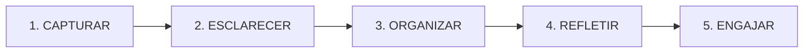
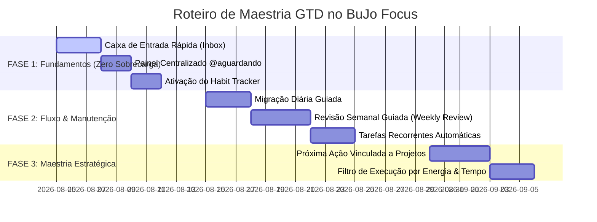

# 🧘 PLANO DE MAESTRIA EM GTD (A ARTE DE FAZER ACONTECER) NO BUJO FOCUS
> **Análise Prática do Livro "A Arte de Fazer Acontecer" (David Allen) Aplicada ao BuJo Focus**  
> *Objetivo: Elevar a organização pessoal, acadêmica e profissional sem gerar sobrecarga cognitiva.*

---

## 📌 1. Visão Geral: Como Fazer o GTD Funcionar Sem Sobrecarga

O princípio fundamental do **GTD (Getting Things Done)** é: **"Sua mente serve para ter ideias, não para guardá-las"**.

Para utilizar o sistema com maestria e **sem sobrecarga cognitiva**, o aplicativo precisa agir como um **segundo cérebro confiável**. A sobrecarga acontece quando você tenta gerenciar tudo de uma vez. O segredo é separar o sistema em 2 camadas:

1. **Camada Operacional (O que fazer AGORA):** Daily Log + Próximas Ações do dia (foco curto).
2. **Camada Estratégica (Onde quero CHEGAR):** Future Log, Coleções, Finanças e Dream Board (revisados semanalmente/mensalmente).

---

## 🔍 2. Mapeamento dos 5 Passos do GTD no BuJo Focus

David Allen define **5 passos estruturais** para dominar o fluxo de trabalho. Veja como eles se alinham ao seu sistema atual e onde estão as lacunas:



### 1. CAPTURAR (Tirar 100% dos pensamentos da cabeça)
* **Status no BuJo Focus:**
  * ✅ **Já existe:** Daily Log (`/daily`) com Rapid Logging para registrar Tarefas (`•`), Eventos (`O`) e Notas (`-`).
  * ❌ **O que falta:** **Caixa de Entrada Geral (Inbox Zero Unificado)**. Hoje toda tarefa precisa de uma data de início. No GTD puro, a captura rápida não deve exigir escolher data de imediato para não interromper o raciocínio.
* **Grau de Importância:** 🔴 **MUITO ALTO (Grau 1)**

### 2. ESCLARECER / PROCESSAR (Decidir o significado de cada item)
* **Status no BuJo Focus:**
  * ✅ **Já existe:** Seleção manual de prioridade (`*`), complexidade, energia e delegação.
  * ❌ **O que falta:** **Assistente de Processamento Guiado (*Inbox Wizard*)**. Um botão *"Processar Caixa de Entrada"* que faz a pergunta chave do GTD: *"É acionável?"*
    * *Sim (Leva < 2 min):* Fazer na hora.
    * *Sim (Leva > 2 min):* Mover para Próxima Ação ou Agendar.
    * *Não:* Excluir, Incubar (Someday/Maybe) ou Arquivar em Coleção.
* **Grau de Importância:** 🟡 **MÉDIO (Grau 2)**

### 3. ORGANIZAR (Colocar cada item no lugar correto)
* **Status no BuJo Focus:**
  * ✅ **Já existe:** 
    * Contextos via Tags (`@computador`, `@trabalho`, `@rua`, `@mestrado`, `@aguardando`).
    * Logs Temporais (Daily Log, Weekly Log, Monthly Log, Future Log).
    * Dream Board (`/dreams`) para metas de longo prazo.
    * Planner Financeiro (`/budget`) para orçamento e gastos.
    * Coleções (`/collections`) para projetos e notas de referência.
  * ❌ **O que falta:** **Painel Centralizado de "@aguardando" / Delegados** e **Status de Projetos Ativos** vinculados a tarefas acionáveis.
* **Grau de Importância:** 🔴 **ALTO (Grau 1)**

### 4. REFLETIR / REVISAR (Manter a confiança no sistema)
* **Status no BuJo Focus:**
  * ✅ **Já existe:** Visualizações de calendário no Monthly Log e linha do tempo.
  * ❌ **O que falta:** **Assistente de Revisão Semanal Guiada (*Weekly Review Wizard*)**. O GTD falha se você não fizer a revisão semanal. Um assistente de 4 passos no fim de semana garante que a mente fique 100% tranquila.
* **Grau de Importância:** 🟡 **MÉDIO (Grau 2)**

### 5. ENGAJAR / EXECUTAR (Fazer com escolha consciente)
* **Status no BuJo Focus:**
  * ✅ **Já existe:** Modo Foco com Timer Pomodoro (`/focus`), priorização com estrela, nível de energia e complexidade.
  * ❌ **O que falta:** **Filtro de Execução por Contexto + Energia + Tempo Disponível**.
* **Grau de Importância:** 🟢 **COMPLEMENTAR (Grau 3)**

---

## ⛰️ 3. Os 6 Horizontes de Foco GTD vs. Módulos do BuJo Focus

David Allen utiliza a metáfora dos **6 Horizontes de Foco** para alinhar ações diárias aos objetivos de vida:

| Horizonte GTD | Descrição | Como é Coberto no BuJo Focus | O que Falta Implementar |
| :--- | :--- | :--- | :--- |
| **5. Propósito e Valores** *(50.000 pés)* | Razão de ser, princípios fundamentais. | **Dream Board** (`/dreams`) | Adicionar campo de "Valores e Propósito" no Dream Board. |
| **4. Visão** *(40.000 pés)* | Onde quero estar em 3 a 5 anos. | **Dream Board** (`/dreams`) | Filtro por Horizonte Temporal no Dream Board (1 ano, 3 anos, 5 anos). |
| **3. Metas** *(30.000 pés)* | Objetivos de 1 a 2 anos (Acadêmico/Profissional). | **Future Log** (`/future-log`) + **Coleções** | Vinculação entre Coleções de Metas e o Future Log. |
| **2. Áreas de Foco** *(20.000 pés)* | Áreas de Responsabilidade (Pessoal, Trabalho, Mestrado). | **Tags & Categorias de Cor** | Visão agregada de tarefas agrupadas por Área de Foco. |
| **1. Projetos Ativos** *(10.000 pés)* | Resultados que exigem mais de 1 ação. | **Coleções** (`/collections`) | Indicador visual de *"Qual é a Próxima Ação deste Projeto?"*. |
| **Térreo. Ações Atuais** *(Superfície)* | O que fazer hoje / agora. | **Daily Log** (`/daily`) | Esvaziamento rápido e migração em 1 clique. |

---

## 🎯 4. Roteiro de Evolução por Grau de Importância

Para não gerar **sobrecarga cognitiva**, as melhorias devem ser implementadas em **3 Fases Progressivas**:



---

### 🔴 GRAU 1: FUNDAMENTAL (Implementar Primeiro — Baixa Complexidade, Altíssimo Impacto)

Estes recursos eliminam o esquecimento de pendências e garantem tranquilidade mental imediata:

#### 1.1. Caixa de Entrada Rápida (*Inbox Capture*)
* **Conceito GTD:** Capturar pensamentos a qualquer momento sem decidir data de imediato.
* **Como implementar no app:**
  * Adicionar uma aba/botão **"Caixa de Entrada"** no Daily Log ou modal rápido (`Ctrl + K`).
  * O usuário digita qualquer pendência rápida.
  * O item fica salvo na Caixa de Entrada e pode ser triado para o Daily Log quando o usuário desejar.

#### 1.2. Painel Centralizado "Aguardando / Delegado" (`@aguardando`)
* **Conceito GTD:** Acompanhar respostas cobradas de terceiros (professores, colegas de trabalho, bancos, entregas).
* **Como implementar no app:**
  * Uma visão dedicada que busca automaticamente todas as tarefas com a tag `@aguardando` ou com o campo `delegatedTo` preenchido.
  * Evita ter que voltar páginas no calendário para saber o que está pendente com outras pessoas.

#### 1.3. Matriz Diária de Hábitos (*Habit Tracker Matrix*)
* **Conceito BuJo + GTD (Nível 2):** Acompanhamento visual da rotina pessoal, acadêmica e de saúde.
* **Como implementar no app:**
  * O backend já possui a estrutura de dados (`habits$` e `habitLogs$`).
  * Exibir no rodapé do Daily Log uma barra de marcação rápida em 1 clique para os hábitos do dia (ex.: *Mestrado, Exercício, Leitura, Água*).

---

### 🟡 GRAU 2: FLUXO E MANUTENÇÃO (Manter o Sistema Vivo Sem Esforço)

Recursos para evitar acúmulo de tarefas velhas e manter o sistema limpo:

#### 2.1. Assistente de Migração Diária Guiada (*Daily Migration*)
* **Conceito BuJo:** Ao abrir o app em um novo dia, o sistema pergunta o que fazer com os itens não concluídos do dia anterior.
* **Como implementar no app:**
  * Modal discreto de inicialização:
    * `>` *Mover para Hoje*
    * `<` *Agendar no Future Log*
    * `X` *Cancelar/Descartar*

#### 2.2. Assistente de Revisão Semanal Guiada (*Weekly Review Wizard*)
* **Conceito GTD:** A revisão semanal é o "motor" do GTD.
* **Como implementar no app:**
  * Um assistente interativo em 4 etapas no final de semana:
    1. Esvaziar a Caixa de Entrada.
    2. Revisar pendências e conquistas da semana.
    3. Olhar o Future Log e o Dream Board.
    4. Selecionar as **3 Grandes Metas (Big Rocks)** da próxima semana.

#### 2.3. Módulo de Tarefas Recorrentes Automáticas
* **Conceito GTD:** Automação de tarefas rotineiras.
* **Como implementar no app:**
  * Permitir marcar uma tarefa como recorrente (diária, semanal, mensal) para que ela reapareça automaticamente no Daily Log da data programada.

---

### 🟢 GRAU 3: MAESTRIA E VISÃO ESTRATÉGICA (Alta Performance)

Para conectar visão de longo prazo ao trabalho do dia a dia:

#### 3.1. Próxima Ação Vinculada a Projetos (Coleções & Dream Board)
* **Conceito GTD:** Nenhum projeto avança sem uma *"Próxima Ação"* claramente definida no Daily Log.
* **Como implementar no app:**
  * Ao criar uma Coleção de Projeto ou um Sonho no Dream Board, permitir criar diretamente uma tarefa acionável vinculada que aparece no Daily Log.

#### 3.2. Filtro de Execução por Energia & Tempo
* **Conceito GTD:** Escolha consciente de tarefas com base no seu contexto atual.
* **Como implementar no app:**
  * Exemplo de uso: *"Estou no celular com 15 minutos livres e pouca energia"* ➔ O sistema filtra apenas tarefas rotuladas como baixas em energia e curtas.

---

## 🧠 5. Guia Prático de Utilização Diária (Sem Sobrecarga)

Siga este ritual diário simples para manter 100% de clareza mental:

```text
🌅 MANHÃ (2 minutos):
1. Abra o BuJo Focus.
2. Defina as 3 "Grandes Metas" (Big Rocks) do dia no Daily Log.
3. Marque a tag do contexto em que você está (ex: @trabalho ou @mestrado).

☀️ DURANTE O DIA:
1. Trabalhe no Modo Foco (Pomodoro).
2. Capturou algo novo? Jogue na Caixa de Entrada sem perder tempo organizando.

🌙 NOITE (2 minutos):
1. Marque os hábitos concluídos na Matriz de Hábitos.
2. Dê baixa nas tarefas concluídas.
3. Feche o app com a mente 100% tranquila.
```

---

## 📄 Conclusão e Próximos Passos
Este plano serve como o mapa estratégico definitivo para transformar seu **BuJo Focus** na ferramenta de produtividade mais eficiente e fluida possível.

O documento foi salvo na raiz do projeto como **`PLANO_MAESTRIA_GTD.md`** para consultas futuras e planejamento de sprints.
